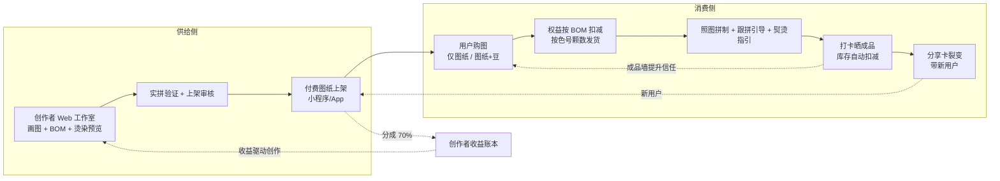
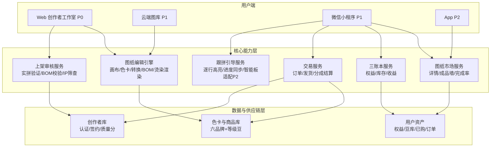
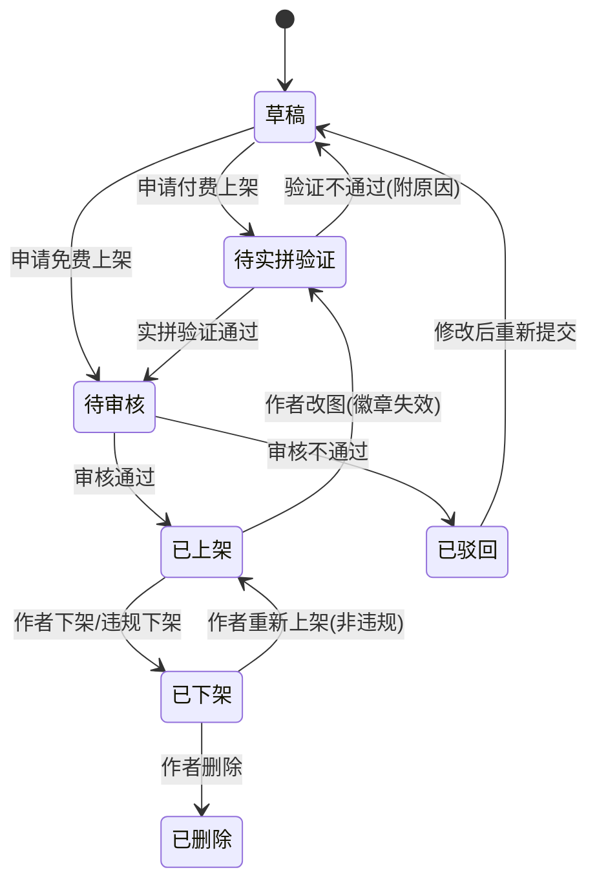
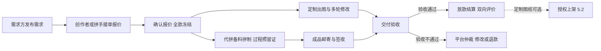

# 拼豆线上生态 · 项目开发需求文档

## 文档信息

| 项目    | 内容                                                                                       |
| ----- | ---------------------------------------------------------------------------------------- |
| 产品工作名 | 豆工坊 PinDou Studio（命名待定）                                                                  |
| 文档版本  | V4.2 总纲                                                                                  |
| 撰写日期  | 2026-09-03                                                                               |
| 文档状态  | 待评审                                                                                      |
| 文档定位  | 全生态开发需求总纲：整合历次产品讨论、六项专项调研与全部技术方案，确立 Web 创作端为 P0 的分阶段开发路线                                 |
| 产品形态  | Web 创作端（P0，本期）→ 云端图库（P1 首项）→ 微信小程序消费端（P1）→ App（P2）                                       |
| 目标读者  | 产品、研发、设计、测试、运营、供应链、法务、财务                                                                 |
| 关联文档  | 《拼豆线上生态产品需求文档》V3.1（生态详设）、《Web创作端需求确认与实现方案》V1.0、《拼豆烫染效果预览-最终需求文档》V1.0、《拼豆市场调研报告》（2026-09） |

版本记录：

| 版本   | 日期         | 修订说明                                                                                                                                     |
| ---- | ---------- | ---------------------------------------------------------------------------------------------------------------------------------------- |
| V1.0 | 2026-09-03 | 首次立项草案：工具 + 社区 + 商城六大模块                                                                                                                  |
| V2.0 | 2026-09-03 | 商业模式重构：确立创作者变现与豆权益预付体系，模块重组为图纸工作室、豆库管理、商城、创作辅助                                                                                           |
| V3.0 | 2026-09-03 | 创作端对齐与拼制体验专项：创作者定位聚焦美术生与审美型人群，新增三档模式、模板中心、跟拼模式；确立"软件跟拼优先、不自研硬件"路线，商城引入第三方智能板品类                                                           |
| V3.1 | 2026-09-03 | Web 创作端先行范围锁定：本期仅交付 Web 创作端；色数口径修订为"不限制色号使用，降色仅建议"；转换管线确定（区域平均 / CIELAB CIEDE2000 / 默认无抖动）                                               |
| V4.0 | 2026-09-03 | 本文档。全生态开发需求总纲：Web 创作端定为 P0 并纳入烫染效果预览模块；沉淀六项调研结论与全部技术选型论证；新增开发资产盘点、验收门禁与里程碑规划                                                             |
| V4.1 | 2026-09-03 | 创作入口重构：确立自由创作 / 导入作品 / 图片转图三入口，图片转图定位为进阶玩家 DIY 路径，美术创作者主路径为自由创作与导入作品；新增生成类型预设（Q版 / 标准 / 写真）及参数规则与商业联动；烫染预设定位澄清：滤镜式交互为需求本体，视觉规格降级为实现参考    |
| V4.2 | 2026-09-03 | 新增 P2 预想模块“定制需求与代拼服务”（6.1）：用户发布 DIY 需求由创作者接单付费定制图纸，用户指定商品由拼手代拼并邮寄成品；确立拼手角色与准入、双服务流程、担保交易与三账本联动、收入线与风控边界，同步更新生态循环、用户画像与故事、优先级矩阵、合规、风险与名词表 |

***

## 1 项目总览

### 1.1 一句话定位

以高质量图纸供给为核心的拼豆创作-消费生态：创作者在 Web 端产出与市面图库同规格、可看到烫染成品效果的高质量图纸，平台由此沉淀图库；消费端（小程序）围绕图纸完成精确配豆、拼制引导、打卡分享的闭环；豆子套餐与图纸交易是主要收入。

### 1.2 市场背景

拼豆在 2024 年底借明星效应与社媒传播破圈，2025 年成为现象级情绪消费赛道：主流电商平台销售额 2.91 亿元、同比增长近 9 倍，淘宝搜索量增长 500%、位列年度十大商品第二名，多家机构预测 2026 年终端零售规模接近 10 亿元。用户结构高度集中：女性占 77.8%–83%，Z 世代与千禧一代合计超过 90%，复购率 62%，45% 的用户每月至少消费一次，核心群体渗透率不足 1%。96.91% 的消费者愿意为精品服务支付溢价，付费驱动前三为优质原料（33.74%）、IP 联名（32.51%）、价格优惠（30.86%）。约 90% 的新手翻车在熨烫环节，图纸获取与配色是第一道门槛。\[数据来源：《拼豆市场调研报告》2026-09，综合东方证券、艾媒咨询、魔镜洞察数据]

### 1.3 战略判断

历次讨论沉淀的五个判断，是全部模块取舍的依据。

判断一：付费图纸是生态的起点。用户不缺购买力，缺的是"照着拼就能成功"的确定性。把创作集中到少数创作者手里，用实拼验证保证质量，用户为被验证过的结果付费——同时解决自创难度、版权风险、高质量图纸稳定供给三个问题。

判断二：豆子是天然的高频复购品。一张图纸对应一份精确的用豆清单（色号 + 颗数），图纸消费持续带动豆子消费，用预付权益把消费锁在本平台。一张 29×29 图纸消耗 841 颗豆，一个进阶玩家一年拼 30 张图，就是 2.5 万颗豆的持续消费。

判断三：创作者是免费的推广渠道。创作者对图纸有直接分成利益，天然乐意在社交平台宣传带码链接，获客成本从"先投放后成交"变为"成交才分成"。

判断四：创作端比的是生态，不是工具。"图片转图纸 + 编辑器 + BOM + 分板打印"的工具链已是红海——拼豆国度、BeadsHub、pindou.top、拼豆王国、拼豆图鉴等十余款免费工具均已覆盖。壁垒在工具之后的"上架、分成、实拼验证、按 BOM 发豆"闭环。同时创作供给充足而变现渠道稀缺：美术类艺考生约 30–46 万（口径存在差异，待核实），像素约稿单价低迷（头像约 50–200 元/张），"画一张图纸持续分成"对美术生是净增量的被动收入。

判断五：拼制的痛苦在"数"不在"拼"，用软件解，不造硬件。玩家最高频拼制痛点是数格子、串行、看不清色号；市面智能拼豆板（LED 引导放豆）供给已成熟（pixdou、PixDotDot 等至少 8 个品牌，零售 129–600 元），但对多数用户是 10–30 倍溢价的增强品。自研硬件没有商业空间（78×78 规格 BOM 约 400–800 元/块，叠加 3C、蓝牙 BQB、SRRC 认证与库存风险）。结论：跟拼模式做纯软件（P1），商城代销第三方智能板（P1），蓝牙适配（P2），平台始终不做硬件制造。

### 1.4 生态循环



供给侧循环：创作者画图 → 实拼验证上架 → 销售分成 → 收益驱动更多创作。消费侧循环：买图纸 → 按图配豆 → 完成打卡 → 成品墙与分享带来新用户。两个循环在"图纸"上交汇，成品墙的打卡数据反过来成为付费信任的依据。定制与代拼（P2 预想，6.1）在两个循环之外补一条服务路径：需求方发布 DIY 需求，创作者接单出图、拼手接单拼制成品邮寄——覆盖不会画也不会拼的用户，为创作者与拼手新增两类收入。

### 1.5 开发路线与优先级框架

本文档以"端"为优先级单位重排全部模块，与 PRD V3.1 的差异：V3.1 中小程序豆库/商城的 P0 项随消费端整体顺延为 P1；Web 编辑器的图层、对称、数位板等专业能力（V3.1 标 P1）因属专业创作工具的标准能力，随 Web 端整体划入 P0 范畴，在 P0 内部再分层排期。

| 优先级       | 范围                                                                                    | 启动条件                 |
| --------- | ------------------------------------------------------------------------------------- | -------------------- |
| P0（本期）    | Web 创作端全部：三类创作入口（自由创作 / 导入作品 / 图片转图，含 Q版 / 标准 / 写真生成类型）、精修编辑器、品牌色号系统、烫染效果预览、导出与本地工程管理 | 立即（开发已过半，见 4.12）     |
| P1（首个大版本） | 云端图库与账号（Web）、创作者上架与收益（Web）、小程序消费端（图纸市场、豆库、商城、跟拼模式、创作辅助）                               | Web 创作端验收通过、图库开始沉淀作品 |
| P2（二期）    | App、智能板蓝牙适配、AI 辅助起稿、大图分区进度、多仓位管理、定制需求市场与代拼服务（6.1）                                     | P1 变现闭环跑通后           |

用户既定的节奏是：先把 Web 端创作做出来，建立图库有了产出，再讨论小程序/App。P0 到 P1 的切换以"图库有产出"为标志，不以时间为标志。

***

## 2 用户与场景

### 2.1 用户画像

| 画像                | 生态角色   | 特征与诉求                                                                                   | 商业角色             |
| ----------------- | ------ | --------------------------------------------------------------------------------------- | ---------------- |
| 图纸创作者（美术生/审美型创作者） | 供给侧核心  | 美术生、像素画师、设计师、手工博主；用惯 Procreate/PS/CSP 与数位板/iPad，在意图层、参考底图、快捷键等专业能力；想靠作品获得持续收入，强烈在意盗图与署名 | 供给与流量来源，生态的发动机   |
| 新手玩家              | 需求侧增量  | 被社交平台种草入坑；不会画图、不懂色号；怕翻车、怕浪费钱                                                            | 体验包 + 入门图纸 + 初级豆 |
| 进阶玩家              | 需求侧存量  | 持有百色以上库存；在意色准与成本；有稳定复购习惯                                                                | 标准包 + 中级豆 + 缺豆计算 |
| 亲子家长              | 需求侧高客单 | 关注安全认证与简单图案；节日与寒暑假峰值消费                                                                  | 亲子图纸套装 + 安全工具    |
| 代拼拼手（P2 预想）       | 服务侧供给  | 手艺稳定、时间灵活的进阶玩家与手工工作室；不画图，靠拼制手艺赚服务费                                                      | 手工服务费 + 带动豆料消耗   |

创作者细分：美术类艺考生约 30–46 万（口径差异待核实），叠加高校美术设计类在校生与像素画师、设计师群体，供给池远大于冷启动所需的 500 名认证创作者。该人群约稿市场现状是像素头像约 50–200 元/张、四向行走图约 100–200 元/套，变现集中在米画师、站酷、小红书。工具习惯分 iPad + Procreate 与数位板 + PS/CSP 两个阵营，对图层、参考底图、对称辅助、快捷键有肌肉记忆。

### 2.2 核心用户故事

创作者：

- 在 Web 上画图、生成用料清单、预览烫染效果并直接标价上架，让作品持续卖钱

- 向买家证明这张图我亲手拼出来过，让他们放心付费

- 拿到带个人码的海报发到社交平台，带来的用户消费时多拿奖励

- 看到哪张图卖得好、完成率高，下一张画什么有依据

- 把 Procreate 草稿拖进参考层半透明透写，对着描格子而不是从零画，把已有画功直接变现

- 不注册就先画一张小图试试手感，判断工具值不值得投入时间

- 在开工前就看到毛巾烫、格利特烫后的成品效果，决定用哪种垫材

新手玩家：

- 花小钱买一张"照着拼必成"的入门图纸，配正好够用的初级豆，第一次就成功

- 知道该用什么温度熨多久，不再凭感觉翻车

进阶玩家：

- 上传喜欢的图片，选 Q 版类型，用几百颗豆拼出一个小挂件——不会画画也能 DIY

- 买图纸时知道哪些色我的库存已有，只补缺的豆、不多买

- 完成作品打卡后库存自动扣减，不用手工记账

亲子家长：

- 买到带 3C 认证、配 24V 低压熨斗的亲子图纸套装，放心和孩子一起做

定制需求方与拼手（P2 预想，见 6.1）：

- 想要一幅婚礼纪念的专属拼豆画，但我不会画也不会拼——发布定制需求说清想法和预算，等创作者出图、拼手拼好寄到家

- 生日前两周想到“拼豆版”礼物——挑一张图下单代拼，直接寄到朋友家

- 手艺好但不会画图的进阶玩家——接代拼订单赚手工费，接单用的豆还能走权益采购

- 创作者接到定制单——按需求出图交付，收一笔一次性定制费，图纸再授权上架继续分成

### 2.3 角色权限

| 角色     | 浏览/购买 | Web 编辑器  | 发布免费图纸 | 发布付费图纸 | 收益提现 | 审核/运营 |
| ------ | ----- | -------- | ------ | ------ | ---- | ----- |
| 游客     | 浏览不可购 | 试用（不可保存） | 否      | 否      | 否    | 否     |
| 注册用户   | 可     | 可        | 可      | 否      | 否    | 否     |
| 认证创作者  | 可     | 可        | 可      | 可      | 可    | 否     |
| 签约创作者  | 可     | 可        | 可      | 可（高分成） | 可    | 否     |
| 运营/管理员 | 可     | 可        | —      | —      | —    | 可     |

定制与代拼（P2，6.1）上线后的权限增量：发布需求对全部注册用户开放；认证创作者增加“接受定制”开关与接单权限；新增“认证拼手”角色承接代拼订单，完整权限矩阵随 6.1 启动时补充。

***

## 3 产品架构

### 3.1 产品形态与分工

| 端       | 定位    | 核心用户与场景                                           | 优先级   |
| ------- | ----- | ------------------------------------------------- | ----- |
| Web 创作端 | 创作者端  | 三档模式画图（模板改编/图片转图/自由绘制）、参考层精修、烫染效果预览、BOM 生成——大屏重创作 | P0    |
| 云端图库    | 内容资产层 | 作品沉淀、浏览分享、效果封面展示——Web 端延伸                         | P1 首项 |
| 微信小程序   | 消费主端  | 逛图纸、买图纸、权益与豆库管理、收货打卡、分享裂变——依托微信传播                 | P1    |
| App     | 深度消费端 | 推送提醒、离线查看已购图纸、消息通知                                | P2    |

三端数据互通：Web 上架的图纸实时出现在小程序，权益、豆库、已购图纸全端同步。

### 3.2 系统架构



架构要点：图纸编辑引擎（含烫染渲染）在 P0 阶段作为纯前端能力先行落地，云端图库上线后平移为共享能力；三账本服务（权益、库存、收益）是 P1 的中枢，交易、豆库、收益结算都经过它；色卡与商品库统一维护"色号 = 等级 = 商品 = 权益费率"的映射，保证图纸里的色号在配豆、发货、扣减各环节口径一致。P2 的定制与代拼撮合（6.1）同样经由交易服务与三账本。

### 3.3 三账本体系

| 账本   | 性质     | 入账                               | 出账                          |
| ---- | ------ | -------------------------------- | --------------------------- |
| 权益账本 | 预付虚拟资产 | 购买套餐、裂变奖励券                       | 购买含豆图纸时按 BOM×等级费率×(1+损耗) 扣减 |
| 库存账本 | 实物台账   | 订单收货自动入账、手动登记已有豆                 | 打卡完成按 BOM 自动扣减（可修正损耗）       |
| 收益账本 | 创作者应收  | 图纸销售分成、带新奖励、打赏；定制费与代拼手工费（P2，6.1） | 提现                          |

设计要点：权益扣减发生在"买图纸配豆"时，库存扣减发生在"完成作品"时，两个时点分离、各自独立对账；已有充足库存的用户走"仅图纸"购买，不动权益；三账本每日对账，差异自动生成工单。

### 3.4 核心用户旅程

创作者旅程：画图（Web，含烫染效果确认）→ 系统生成 BOM → 实拼并上传成品照（实拼验证）→ 定价上架（1 个工作日审核）→ 分享带码海报 → 销售分成实时入账 → 看板复盘选题 → 下一张图。

消费者旅程：看到分享卡或推荐 → 图纸详情页（成品墙、完成率、实拼徽章、烫染效果展示）→ 购买"图纸+豆"（选等级与损耗系数，权益扣减）→ 豆子按色号颗数发货 → 收货自动入库 → 照图拼制（跟拼模式引导、熨烫参数指引）→ 打卡晒成品（库存自动扣减、得分享券）→ 分享卡裂变新用户。

两条旅程的交汇点是图纸详情页：创作者的成果展示与用户的购买决策发生在同一页面，成品墙同时服务于信任建设与流量转化。

### 3.5 全局优先级矩阵

全生态模块地图，是本文档后续章节的索引。各模块的功能编号（F#、G#）为模块内编号，跨模块不通用：

| 模块         | 所属端 | 优先级     | 章节  | 一句话定义                                   |
| ---------- | --- | ------- | --- | --------------------------------------- |
| 创作入口与图片转图纸 | Web | P0      | 4.3 | 自由创作 / 导入作品 / 图片转图三入口；生成类型 Q版 / 标准 / 写真 |
| 精修编辑器      | Web | P0      | 4.4 | 参考层 + 工具集，微调至完美                         |
| 品牌色号系统     | Web | P0      | 4.5 | 六品牌真实色号，不限制使用                           |
| 烫染效果预览     | Web | P0      | 4.6 | 滤镜式烫后效果预设（8 种）                          |
| 导出与工程管理    | Web | P0      | 4.7 | 图纸 PNG / BOM CSV / 工程 JSON              |
| 对称、图层、数位板  | Web | P0 内 P1 | 4.4 | 专业创作能力增强                                |
| 三档模式与模板中心  | Web | P0 内 P1 | 4.4 | 轻创作模板改编入口（模板中心随 P1 上线）                  |
| 云端图库与账号    | Web | P1      | 5.1 | 作品云端沉淀与分享                               |
| 上架、实拼验证、收益 | Web | P1      | 5.2 | 创作者变现闭环                                 |
| 豆库管理       | 小程序 | P1      | 5.3 | 权益、库存、缺豆计算                              |
| 商城         | 小程序 | P1      | 5.4 | 图纸市场、套餐、实物商品                            |
| 创作辅助与跟拼模式  | 小程序 | P1      | 5.5 | 拼制数字引导、熨烫指引                             |
| 定制需求市场     | 小程序 | P2      | 6.1 | 用户发布 DIY 需求，创作者接单付费定制图纸                 |
| 代拼服务       | 小程序 | P2      | 6.1 | 用户指定商品，拼手代拼并邮寄成品                        |
| App        | App | P2      | 6   | 深度消费端                                   |
| 智能板蓝牙适配    | 跨端  | P2      | 6   | 第三方智能板协议对接                              |
| AI 辅助起稿    | Web | P2      | 6   | 线稿转像素图、配色建议                             |

***

## 4 P0 · Web 创作端（本期开发范围）

### 4.1 范围与目标

做一个 Web 端创作工具，以三类入口服务两类人群：美术创作者（美术生、像素画师、设计师）从空白画布自由创作，或导入自己的作品（Procreate / PS / CSP 导出图）描格精修；进阶玩家上传任意图片 DIY 转图（可选 Q版 / 标准 / 写真生成类型）。三条入口汇入同一个编辑器：图纸生成或绘制 → 手动微调至完美 → 像选滤镜一样预览烫染后的成品效果 → 导出与市面图库同规格的图纸文件（图案 PNG + 色号清单 + 工程文件）。先建立"我们能稳定产出高质量图纸"的能力，图库内容由此沉淀。

本期明确排除（待图库有产出后按 P1 接入）：登录注册与创作者认证、云端存储与多人协作、图纸上架与交易、BOM 对接豆权益购买、实拼验证流程。

成功标准：用与用户样图同类的素材（动漫角色、卡通插画）转换并微调后，产出的图纸在色号体系、版式、可读性上与市面主流图库一致（4.2 的 Q1–Q6 全过），烫染效果六种预设肉眼可区分且贴近实物特征，全程不离开浏览器。

### 4.2 图纸质量标准

#### 4.2.1 样图基线

对用户提供的实际图纸（55×63、Q 版角色、MARD 色号）的分析，提炼出市面主流图库的质量基线：

| 维度   | 样图实测                                         | 对实现的约束                   |
| ---- | -------------------------------------------- | ------------------------ |
| 网格规模 | 55×63（约 3,465 格，有效豆约 2,300 颗）                | 编辑器流畅支持到 104×104，导出带坐标标注 |
| 色数   | 17 色，主色集中（黑 539 / 深粉 237 / 黄绿 142，前三色占 40%+） | 色数由用户与素材决定，工具提供降色建议而非硬限制 |
| 过渡方式 | 硬边色块，无抖动（无棋盘混色）                              | 转换默认无抖动，保持"每格一色、色块分明"    |
| 边缘处理 | 选择性黑描边：仅外轮廓与结构线用黑色，内部色块直接相邻                  | 轮廓可读性优先于色彩丰富度            |
| 色号体系 | MARD 字母+数字编码（H7 黑、F7 深粉、B14 黄绿等）             | 色板内置品牌真实色号，色号可追溯         |
| 图例规范 | 底部图例：色块 + 色号 + 使用颗数                          | 导出图纸 PNG 带同规格图例与用量统计     |

#### 4.2.2 质量验收标准（转换与导出共用）

| #  | 标准                                              | 验收方式                  |
| -- | ----------------------------------------------- | --------------------- |
| Q1 | 每格恰好一色，色号可追溯到品牌色卡（MARD/COCO/Perler/Hama/Artkal） | BOM 中每个色号在色板数据库中存在    |
| Q2 | 默认无抖动：相邻格为不同纯色色号，无混色噪点                          | 视觉检查 + 色数统计合理（非碎片化）   |
| Q3 | 色块成簇：孤立单格色（四周异色）占比低                             | 孤立格占比统计（目标 <5%，卡通类素材） |
| Q4 | 轮廓可读：主体与背景明度差足够，边缘不糊                            | 与原图对照目测，边缘格颜色归属明确     |
| Q5 | 图纸版式与市面图库一致：网格 + 坐标刻度 + 图例（色号 + 颗数）             | 导出 PNG 与样图版式对照        |
| Q6 | 颜色还原：屏幕显示色与品牌色卡 RGB 参考值一致                       | 逐色对照色板数据库             |

#### 4.2.3 "与平常使用的图库一致"的三个落点

1. 色号一致：内置 MARD 291 / COCO 293 / Perler 103 / Hama 92 / Artkal 全系列色板（含真实色号与 RGB 参考值），图纸上的每个颜色都是可采购的真实色号。
2. 版式一致：导出图纸 PNG 复刻样图规格——网格图案区 + 每 5 格坐标刻度 + 底部图例（色块、色号、颗数）。
3. 质量一致：转换管线按 4.3 设计，产出硬边、成簇、轮廓可读的色块风格，而非照片式平滑渐变。

### 4.3 模块 W1 · 创作入口与图片转图纸

#### 4.3.1 三类创作入口

| 入口   | 目标人群                | 起点素材                                    | 典型路径                        |
| ---- | ------------------- | --------------------------------------- | --------------------------- |
| 自由创作 | 美术创作者（美术生、像素画师、设计师） | 空白画布                                    | 从零绘制；需要底稿时随时把草图贴入参考层透写      |
| 导入作品 | 美术创作者               | 自己的作品（Procreate / PS / CSP 导出的 PNG、JPG） | 导入为参考层描格精修，或直接转图后微调，把已有画功变现 |
| 图片转图 | 进阶玩家、手工博主           | 任意图片（照片、插画、截图）                          | 选生成类型一键转图，再精修               |

定位（V4.1 确立）：图片上传转图只是 Web 创作的一种入口，且主要是进阶玩家 DIY 的方法；美术创作者的主路径是自由创作与导入自己的作品。三条入口不锁能力——进入编辑器后，参考层、转换、精修、烫染预览全量可用，入口只是起点不同。默认行为差异：图片转图入口默认进入转换流程（含生成类型选择）；自由创作与导入作品入口默认进入空白画布（导入作品自动把图片挂到参考层），需要时随时可从编辑器内发起转换。

#### 4.3.2 图片转图交互工作流（五步）

```text
① 上传      拖拽/选择图片（PNG/JPG/WebP，≤10MB），支持透明背景
② 选生成类型 Q版 / 标准 / 写真（见 4.3.3），类型预置目标尺寸、色数建议与风格
③ 转换      预置参数可再调（目标尺寸 29/52/58/87/104/自定义、品牌色板、平滑/卡通、
            亮度/对比度/饱和度、移除纯色背景）；左侧原图、右侧结果实时对照
④ 精修      转换结果进入编辑器；原图作为参考层（不透明度 0–100% 可调，
            可置于网格下方透写或上方对照）；画笔/油漆桶/图形工具逐格微调
⑤ 导出      图纸 PNG（带图例）/ BOM 清单 CSV / 工程文件 JSON（可再编辑）
```

#### 4.3.3 生成类型预设（Q版 / 标准 / 写真）

交互心智与烫染预设（4.6.1）同构：用户选的不是参数，是作品的样子。生成类型是面向结果的转换参数预设：

| 类型 | 一句话心智           | 预置目标尺寸          | 色数              | 细节策略            | 预置风格                                 |
| -- | --------------- | --------------- | --------------- | --------------- | ------------------------------------ |
| Q版 | 更可爱，少量豆子也能拼出小作品 | 20×20 至 29×29   | 建议 ≤16 色（不强制）   | 五官简化、特征色保留、色块成簇 | 卡通（众数主导色）、无抖动                        |
| 标准 | 通用默认            | 29×29 至 58×58   | 由素材决定（不限制）      | 硬边色块、轮廓可读       | 卡通                                   |
| 写真 | 大尺寸还原，适用于大尺寸拼图  | 58×58 至 104×104 | 不限制（典型 30–60 色） | 渐变保留、细节优先       | 平滑（区域平均）；可选轻度抖动（Bayer 4×4，随 P1 高级选项） |

规则：

- 类型是起点不是约束：所有预置参数在第③步均可修改，与"不限制色号使用"的口径一致（4.5.3）

- 生成类型作用于转换流程（4.3.2），从任一入口发起转换时均可选用

- Q版不做图像内容改造（五官与头身比由源图决定），预设只控制尺寸、色数建议与风格；Q 版形象来自源图本身（动漫头像、卡通插画天然适配），需要改造形象时用参考层手绘，或等 P2 AI 辅助起稿

- 豆量与商业联动：Q版 20×20 ≤400 颗、29×29 ≤841 颗，新手体验包（10,000 颗权益）可拼 10 张以上；写真 104×104 约 10,816 颗，对应进阶玩家的大额消耗

- 写真 58×58 以上图纸的导出支持 A4 分页打印（随 P0 内 P1 排期，对齐 4.7）

- 类型体系可扩展：挂件、徽章、双人像等随 P1+ 运营节奏增加

#### 4.3.4 转换技术管线（调研选型结论）

| 阶段    | 选型                              | 依据                                                           | 弃用项及原因                                       |
| ----- | ------------------------------- | ------------------------------------------------------------ | -------------------------------------------- |
| 降采样   | 阶梯式减半 + 区域平均（纯 JS box filter）   | 大幅缩小时区域平均最稳定，不产生振铃；阶梯式避免一步缩放的采样偏差                            | Lanczos：清晰度好但高对比边缘有振铃伪影且需引入库；留作 P1 对比选项      |
| 每格代表色 | 双模式：平滑（区域内平均）/ 卡通（区域内量化后取众数主导色） | 平滑适合照片类素材；卡通模式保平涂色块与边缘干净，直接对标样图风格                            | 仅平均色：平涂图边缘会被背景色"染灰"，是竞品用户抱怨"轮廓糊掉"的主因         |
| 色号匹配  | sRGB → CIELAB，CIEDE2000 色差取最近色号 | 感知均匀，已有拼豆工具（BeadsCanvas、pixel-pattern、perler-studio）采用同路线并验证 | RGB 欧氏距离：人眼感知差异大，暗色区误差明显；DeltaE76：黄色区权重失真    |
| 抖动    | 默认关闭（硬边）                        | 拼豆图纸每格一色，误差扩散会产生噪点网格，与"色块分明"的图库风格冲突（样图即无抖动）                  | Floyd-Steinberg：不作为默认；P1 可选 Bayer 4×4 轻度明暗模拟 |
| 背景处理  | Alpha 通道直通 + 边缘扩散式纯色背景移除（容差可调）  | 透明 PNG 直接透空；白底卡通图移除后即得样图式的"无背景图纸"                            | 阈值二值化：破坏主体颜色                                 |
| 量化缓存  | 代表色量化 5bit 后缓存匹配结果              | 10816 格 × 291 色的 CIEDE2000 全量计算重；缓存后典型素材 <200ms              | —                                            |

#### 4.3.5 边界与提示

- 低分辨率图片（<100×100 像素）与近乎纯色的图片分别提示更换

- Q版：写实照片类源图提示"Q 版更适合卡通 / 插画类图片，写实照片建议裁剪主体或改用写真类型"；源图过于复杂（全身群像）时提示裁剪主体

- 写真：超过 104×104 的多板拼接大图 P0 不支持，P2 大图分区进度承接（6）

- 上传前预压缩（Canvas 限制最长边 2048），控制大图内存占用

- 图片转图纸产出的作品未来申请付费上架时，创作者须持有原图版权或使用自有照片，审核环节核验来源声明（P1 上架流程承接）

### 4.4 模块 W2 · 精修编辑器

#### 4.4.1 能力清单

| 能力    | 说明                                             | 优先级     |
| ----- | ---------------------------------------------- | ------- |
| 绘制工具  | 画笔、橡皮、油漆桶（同色连片填充）、直线、矩形、椭圆、吸管（Alt+点击）          | P0      |
| 视图    | 缩放（滚轮）、平移、适应窗口、显示/隐藏网格线、高倍率下显示色号首字母            | P0      |
| 撤销重做  | 100 步历史（Ctrl+Z / Ctrl+Shift+Z）                 | P0      |
| 全局换色  | 用量面板中一键把某色号全部替换为当前选中色（降色、改配色的核心操作）             | P0      |
| 清除颜色  | 一键清除某色号全部格子（去孤立碎色）                             | P0      |
| 色板操作  | 按色号/名称搜索；色板按色系分组；最近使用                          | P0      |
| 工程保存  | 浏览器自动保存 + 工程文件导出/导入（JSON，含参考图）                 | P0      |
| 新建项目  | 规格（5mm/2.6mm）、板型（7×7 至 104×104）、品牌色卡三选，创建后品牌锁定 | P0      |
| 参考层   | 原图置于网格下方（透写描图）或上方（对照检查），不透明度可调，可开关             | P0      |
| 对称绘制  | X/Y 镜像对称绘制（对标 Clip Studio Paint 对称尺）           | P0 内 P1 |
| 图层系统  | 参考层/草稿层/成稿层三层，仅成稿层参与 BOM                       | P0 内 P1 |
| 数位板支持 | 笔尖悬停预览、防误触、笔侧键映射橡皮擦                            | P0 内 P1 |
| 三档模式  | 轻创作（模板改编）/ 标准（默认）/ 专业（全量能力），共用同一画布引擎           | P0 内 P1 |

#### 4.4.2 关键业务规则

同一项目锁定单一品牌色卡，项目内不允许混用品牌色号——不同品牌豆子存在色差与熔点差异，混用是买家翻车的高频原因，供给端必须杜绝。跨品牌切换时已用色号按 CIEDE2000 色差自动映射，映射格显示角标待确认。空画布提供模板一键载入（模板中心随 P1 上线，P0 的新建入口按 4.3.1 提供三条路径：从空白开始 / 导入我的作品 / 从图片转图）。

快捷键体系对齐主流工具肌肉记忆：B 画笔、E 橡皮、G 油漆桶、I 吸管、\[ ] 调整笔刷大小、Ctrl+Z/Y 撤销重做、空格平移、Alt+点击吸管；命令面板（Ctrl+/ 搜索全部功能，对标 Figma）随专业档排期。

### 4.5 模块 W3 · 品牌色号系统

#### 4.5.1 色板数据库（已落地）

数据源：beadcolors 社区数据集（MIT License）+ bead\_color\_matcher（MIT），已拉取并通过格式校验：

| 品牌      | 色数                       | 编码示例            | 尺寸口径                       | 状态  |
| ------- | ------------------------ | --------------- | -------------------------- | --- |
| MARD 码德 | 291                      | A1、F7、H7、B14    | 2.6mm（291 全集）/ 5mm（221 子集） | 已入库 |
| COCO    | 293                      | A01、E02、K39     | 2.6mm                      | 已入库 |
| Perler  | 103                      | 80-15179、P53    | 5mm                        | 已入库 |
| Hama    | 92                       | H01、H18         | 5mm Midi                   | 已入库 |
| Artkal  | R89 / S199 / A145 / C174 | R01、S13、A01、C01 | R/S 5mm；A/C 2.6mm          | 已入库 |

合计 1,386 色（MARD 291 / COCO 293 / Perler 103 / Hama 92 / Artkal 四系 607），色数已按编辑器色板解析器的实际加载口径逐一核验（各文件唯一色号无重复）。

优肯（UKENN）暂无公开 RGB 数据集，P2 以人工映射表接入。

#### 4.5.2 数据治理约定

- RGB 为屏幕参考值（实物受批次、光照、熔融影响，页面标注"以实物色卡为准"）

- 珠光/夜光/UV/果冻等特殊效果色标记 `color_type`，不参与默认匹配（其 RGB 不代表实观感）

- 跨品牌切换按 CIEDE2000 提示近似色，不做硬映射

- 品牌名保留商标提示，不暗示官方授权

#### 4.5.3 "不限制色号使用"的产品口径

- 无硬性色数上限：编辑器开放色板全部色号，用户想用多少色就用多少色（含特殊效果色，标记但不拦截）

- 降色是建议不是门槛：降色工具（相似色合并、全局换色、清除碎色）帮助用户主动优化，提示语为"买家成本参考"；24 色档位修订为建议档位而非强制值

- 色数只影响建议价与成本提示，不阻止创作

- 商业逻辑：当用户缺某个色号时，更趋向于购买平台的拼豆套餐省心——BOM 数据结构按"色号 = 等级 = 商品 = 权益费率"映射预留字段（`brand`/`code`/`count`），后续小程序商城上线后，"缺色号 → 购套餐/补豆"的路径直接复用，无需迁移

### 4.6 模块 W4 · 烫染效果预览

#### 4.6.1 定位：滤镜预设范式

本功能在产品上就是"P 图软件的滤镜"：一排预设缩略图、单击应用、画布实时预览、强度滑杆、按住对比原图。对标修图 App 的滤镜交互范式，而非专业渲染器的材质编辑器。核心心智：用户选的不是参数，是成品的样子。

需求本体与实现参考的分界（V4.1 澄清）：产品需求本体是上述滤镜式交互体验；各烫法的具体视觉呈现（表面质感、光泽、色彩偏移等物理描述）属于研发实现范畴，以实物照片为对照基准迭代调优。4.6.3 的视觉描述仅为实现参考基线，不构成需求规格；产品验收只看用户感知层面的两条标准（4.11）：肉眼可区分、贴近实物特征。

| 修图 App 滤镜范式 | 本功能对应                      |
| ----------- | -------------------------- |
| 滤镜列表（缩略图横滑） | 烫法预设列表（每种烫法的实时小样，用当前作品渲染）  |
| 单击应用、实时预览   | 点选烫法，画布即时切换烫后效果            |
| 滤镜强度滑杆      | 效果强度（0–100%，100% 还原真实工艺观感） |
| 按住查看原图      | 按住查看未烫的平面图纸                |
| 滤镜分组        | 烫法分组（经典/质感/闪亮）             |
| 滤镜名 + 说明    | 烫法名 + 工艺卡（垫材、撕取时机、注意事项）    |

不做的：自由调参的专业模式（法线强度、光泽角度等物理参数不暴露）、多效果叠加（一块板子只烫一次，符合真实工艺）、AI 生成式效果（本功能是物理模拟）。

#### 4.6.2 预设清单

预设命名遵循社区通用叫法（用户参考图与小红书生态术语），共 8 种、3 组：

| # | 预设名  | 分组 | 垫材             | 优先级     | 状态         |
| - | ---- | -- | -------------- | ------- | ---------- |
| 1 | 正常烫  | 经典 | 烘焙布            | P0      | 原型已验证      |
| 2 | 毛巾烫  | 质感 | 双层毛巾（趁热撕）      | P0      | 原型已验证（迭代中） |
| 3 | 格利特烫 | 闪亮 | 格利特布/亮片布（放温后撕） | P0      | 原型已验证（迭代中） |
| 4 | 亮片烫  | 闪亮 | 亮面烫片           | P0      | 原型已验证（迭代中） |
| 5 | 华夫格烫 | 质感 | 华夫格纹理布         | P0 内 P1 | 原型已验证      |
| 6 | 搓澡巾烫 | 质感 | 烘焙布 + 搓澡巾（趁热撕） | P0 内 P1 | 原型已验证      |
| 7 | 单面无孔 | 经典 | 烘焙布（不烫手后撕）     | P2      | 规格预定义      |
| 8 | 褶皱烫  | 质感 | 空气炸锅垫纸         | P2      | 规格预定义      |

#### 4.6.3 预设视觉参考（实现基线，非需求规格）

共性基底：所有烫法从"熔融豆阵"出发——豆格色块 + 隐约豆间十字缝 + 中孔闭合浅痕 + 熔融软化。下表为研发对照实物照片调优的起点参考，最终效果以实物对照验收（4.11），不作为需求逐项锁定。各预设在此之上叠加表面结构：

| 预设   | 表面                        | 光泽                  | 边缘             | 色彩                                |
| ---- | ------------------------- | ------------------- | -------------- | --------------------------------- |
| 正常烫  | 平整致密，十字缝隐约                | 柔和哑光，漫反射为主          | 完全保留，边界锐利      | 无偏移（色彩保真基准）                       |
| 毛巾烫  | 三层绒毛（低频簇+纤维束+单丝），豆结构大部分遮蔽 | 强漫反射，几乎无高光          | 绒毛扩散软化，细节轻微丢失  | 偏暖、降饱和、明度降 1–2 级；深色作品有显脏风险（工艺卡提示） |
| 格利特烫 | 双层闪粉（大颗星芒+细闪糖霜）           | 多向散射闪烁，每粒轻微虹彩       | 基本保留，轻微光学边缘膨胀  | 饱和度升高、明度提升，部分色相金属偏光化              |
| 亮片烫  | 大颗亮片单元（大于单颗豆），片间缝隙暗线      | 镜面反射主导，连续斜向反光带，高光锐利 | 中低融合，宏观轮廓轻微锯齿化 | 对比剧增，高光极亮但保留底色不过曝                 |
| 华夫格烫 | 规则方格凹凸压痕（坑壁+坑底）           | 结构光影，凹坑壁迎光面亮        | 较高保留           | 轻微偏暖，明度由光影结构调制                    |
| 搓澡巾烫 | 细密不规则网眼 + 织物经纬微纹理         | 弱漫反射，纹理阴影产生灰调       | 较高保留，细微模糊      | 偏灰、降饱和，做旧感                        |
| 单面无孔 | 均匀光滑，无孔无缝                 | 均匀哑光偏半光             | 完全保留           | 无偏移                               |
| 褶皱烫  | 低频规则褶皱压印                  | 哑光，褶皱凸起处轻微提亮        | 完全保留           | 纸张哑光质感                            |

#### 4.6.4 功能需求

| #  | 模块      | 优先级     | 一句话定义                                |
| -- | ------- | ------- | ------------------------------------ |
| F1 | 效果预览面板  | P0      | 编辑器内选烫法、看效果的滤镜式面板；预设缩略图用当前作品低分辨率渲染   |
| F2 | 画布实时渲染  | P0      | 选定烫法后画布即时呈现烫后效果，隐藏网格与色号标注，Esc 返回编辑视图 |
| F3 | 强度调节    | P0      | 0–100% 滑杆，表面结构、色彩偏移、光泽强度同系数插值        |
| F4 | 对比查看    | P0      | 按住"对比"按钮或空格键，瞬时切换平面图纸原样              |
| F5 | 工艺参数卡   | P0 内 P1 | 垫材、撕取时机、镜像提示、温度注意、深浅色建议              |
| F6 | 保存与效果封面 | P0      | 保存固化预设 key 与强度，异步生成全分辨率效果封面 PNG      |
| F7 | 效果图导出   | P0 内 P1 | 竖版分享图：上半效果渲染 + 下半信息条（标题/格数/色数/豆数/烫法） |
| F8 | 图库展示联动  | P1      | 作品卡默认用效果封面，详情页"图纸/效果"切换，默认进效果视图      |
| F9 | 材料推荐入口  | P2      | 工艺卡上的垫材商城入口（烫法→垫材包，与缺豆引导同构）          |

关键规则：效果是渲染层属性，不修改图纸像素数据，视图切换零副作用；渲染在 Web Worker 或分片任务执行，不冻结 UI；画布修改后缩略图标记过期并按最新画布重算；效果封面生成失败不阻塞保存，降级用平面图纸图。

#### 4.6.5 技术实现（调研选型结论）

四条技术路线对比：

| 路线                    | 机制                               | 优点                 | 缺点                 | 结论                 |
| --------------------- | -------------------------------- | ------------------ | ------------------ | ------------------ |
| Canvas 2D 逐像素管线       | ImageData 逐像素：高度场→法线→光照→特效→色调映射  | 无依赖、全兼容、算法即代码、可控性强 | CPU 渲染，超大画布吃力      | 采用（主路线）            |
| WebGL fragment shader | GPU 并行，FBM 噪声/法线/各向异性高光/glitter  | 实时性能最佳，可做动态视角      | 开发调试成本高            | 备选（未来动态光照/视角旋转时启用） |
| SVG filter            | feTurbulence + feDisplacementMap | 声明式简单              | 无法实现星芒、镜面反光带等核心效果  | 排除                 |
| 预渲染纹理叠加               | 预制纹理 multiply/overlay/screen 混合  | 开发最快               | 效果固定，无法随作品颜色/尺寸自适应 | 排除（仅草稿验证用）         |

选型论证：本功能的交互模式是离散选择式预览（选烫法 → 渲染一次 → 看静态结果），不是连续实时调节。Canvas 2D 性能完全覆盖（原型实测 55×63 格约 58 万输出像素，单次渲染在交互可接受范围内完成），WebGL 的性能优势在本场景无增量价值。若未来加入"转动视角看反光"或视频化分享，再升级 WebGL，届时渲染逻辑可平移（管线算法与渲染后端解耦）。

已验证的渲染管线：

```text
工程数据（cells + 色板）
  → 熔融基底绘制（豆格色块 + 十字缝 + 中孔痕 + 熔融模糊）
  → 高度场生成（豆圆顶基础 + 烫法专属表面结构）
  → 逐像素：中心差分求法线 → 漫反射 + 高光光照
  → 烫法特效层（绒毛/星芒/亮片阵列/格纹/网眼）
  → 色调映射（饱和度/明度/暖偏/对比度）
  → 效果图
```

#### 4.6.6 性能要求

| 指标               | 要求                                 |
| ---------------- | ---------------------------------- |
| 单预设切换渲染（55×63 格） | ≤ 1s，渲染期不冻结 UI                     |
| 面板首次打开全预设缩略图生成   | ≤ 3s，逐个替换不阻塞                       |
| 强度拖动重渲染          | 停顿 150ms 后触发，完成 ≤ 1s               |
| 效果封面生成           | 异步后台，保存动作本身 ≤ 500ms 返回             |
| 移动端 Web          | 可用（面板降级为底部横滑条），渲染放宽至 2s            |
| 降级策略             | 低端设备或 >100×100 作品自动降低预览分辨率（导出不受影响） |

#### 4.6.7 原型验证记录

第一轮浏览器验证（六种效果整体可区分、无控制台报错）暴露的逼真度问题与已实施的迭代：

| 烫法   | 第一轮问题      | 已实施迭代                         | 状态        |
| ---- | ---------- | ----------------------------- | --------- |
| 正常烫  | 偏亮、哑光感不足   | 降高光强度与整体明度，加烘焙布低频压痕           | 参数已更新，待复验 |
| 毛巾烫  | 纤维感规则化、像帆布 | 重构三层绒毛（低频簇+各向异性束+高频丝）+ 绒毛散射雾化 | 算法已重构，待复验 |
| 格利特烫 | 闪光颗粒不可见    | 双层粒子体系（大颗星芒+细闪糖霜），星芒十字光臂形状    | 算法已重构，待复验 |
| 亮片烫  | 严重过曝成全白    | 反光带模型（部分片正对高光）+ 底色保留混合 + 片间暗线 | 算法已重构，待复验 |
| 华夫格烫 | 一次到位       | 无                             | 已达标       |
| 搓澡巾烫 | 网眼密度不足     | 提高网眼频率与暗度、加织物经纬微纹理            | 参数已更新，待复验 |

待办：迭代版本第二轮视觉复验（同一浏览器验证流程），之后用真实作品照片并排对照微调参数。属研发排期内的打磨工作，不阻塞需求评审。

### 4.7 模块 W5 · 导出与工程管理

导出三件套（用途不同、互不替代）：

| 产物         | 规格                                        | 用途   |
| ---------- | ----------------------------------------- | ---- |
| 图纸 PNG     | 网格图案区 + 每 5 格坐标刻度 + 底部图例（色块、色号、颗数），复刻样图版式 | 制作照拼 |
| BOM 清单 CSV | 色号、色名、颗数、占比、总颗数                           | 采购对账 |
| 工程文件 JSON  | 含 cells、色板引用、参考图、烫染设置                     | 再编辑  |

工程管理：浏览器 localStorage 每 30 秒自动保存；工程文件导出/导入恢复；新建空白图纸（规格/板型/品牌三选）。效果分享图导出（4.6.4 F7）随 P0 内 P1 排期。

### 4.8 数据模型

工程文件（JSON）结构：

```json
{
  "v": 1,
  "title": "作品标题",
  "brandKey": "mard",
  "w": 55,
  "h": 63,
  "cells": [/* 色板索引数组，-1 为空格 */],
  "finish": {
    "preset": "glitter",
    "intensity": 100
  }
}
```

规则：`finish.preset` 取值 `normal` / `towel` / `glitter` / `sequin` / `waffle` / `loofah` / `noflap` / `wrinkle`，`intensity` 为 0–100 整数；字段整体可缺省（等于 `normal` + 100），旧工程文件打开后可修改重存。BOM 行结构预留 `brand` / `code` / `count` 字段，对齐 P1 的"色号 = 等级 = 商品 = 权益费率"映射。效果封面图不属于工程 JSON（体积考虑），由保存流程生成并上传图库资产存储，URL 由图库侧管理。

### 4.9 技术架构

技术栈：Vite + React + TypeScript，纯前端实现（转换管线与烫染渲染均为纯 JS，无服务端依赖），色板数据构建期内置。

代码结构（现状）：

```text
src/
  lib/
    types.ts          核心类型定义（Project、BeadColor、Tool 等）
    color.ts          色彩科学：sRGB→CIELAB、CIEDE2000
    palettes.ts       品牌色板加载与管理
    converter.ts      图片转图纸管线（降采样/代表色/色匹配/缓存）
    patternSheet.ts   图纸 PNG 渲染与导出（网格/刻度/图例）
    storage.ts        工程持久化（localStorage/导入导出）
  components/
    CanvasStage.tsx   画布（绘制工具/缩放平移/参考层）
    ToolRail.tsx      工具栏
    PalettePanel.tsx  色板面板
    StatsPanel.tsx    用量与 BOM 面板
    ImportDialog.tsx  图片导入与转换
    NewDialog.tsx     新建项目
  App.tsx             应用集成（状态/快捷键/自动保存/导出）
  data/               六品牌色板 CSV
public/
  demo.html           烫染效果渲染原型（六烫法完整管线，可运行）
```

架构决策记录：

- 纯前端先行：P0 不引入账号与后端依赖，部署轻、迭代快；云端图库（P1）上线后工程数据平移云端，本地存储保留为离线兜底

- 转换与渲染算法全部自研为纯函数库（lib/），与 UI 解耦，未来小程序端（通过 WebView 或端口重写）与导出服务可复用

- 烫染渲染管线与渲染后端解耦（Canvas 2D 实现，算法层可平移 WebGL）

### 4.10 性能与兼容

| 指标      | 要求                                                              |
| ------- | --------------------------------------------------------------- |
| 转换耗时    | 104×104 目标网格 + 291 色板 ≤ 2s（含量化缓存）                               |
| 编辑流畅    | 104×104 网格绘制响应 ≤ 100ms                                          |
| 撤销重做    | 100 步历史内即时响应                                                    |
| 自动保存    | 30 秒周期，不阻塞绘制                                                    |
| 烫染渲染    | 见 4.6.6                                                         |
| 浏览器兼容   | 近两年主流 Chrome / Edge / Safari / Firefox（Canvas 2D 全覆盖，不依赖 WebGL） |
| 移动端 Web | 创作工具以桌面为主，移动端可浏览已导出图纸                                           |

### 4.11 验收标准

| 类别 | 验收项      | 标准                                                             |
| -- | -------- | -------------------------------------------------------------- |
| 质量 | 样图复刻     | 将用户样图同规格（55×63、MARD 色板、卡通模式）转换同类素材，产出硬边、成簇、轮廓可读的图纸（Q1–Q6 全过）   |
| 质量 | 色号可追溯    | BOM 全部色号在色板数据库中存在，屏幕色与色卡 RGB 一致                                |
| 功能 | 工作流闭环    | 上传 → 转换 → 参考层微调 → 烫染预览 → 导出三件套，全程浏览器内完成                        |
| 功能 | 无色数限制    | 任意色号（含特殊效果色）可选用，无拦截                                            |
| 功能 | 生成类型     | Q版 / 标准 / 写真可选；Q版产出 ≤29×29 且色数建议生效；写真支持 104×104 全尺寸转换；预置参数可被覆盖 |
| 功能 | 烫染效果     | 六种预设肉眼可区分、贴近实物特征；强度与对比交互可用；切换零副作用                              |
| 性能 | 转换/编辑/烫染 | 4.10 与 4.6.6 指标全过                                              |
| 兼容 | 浏览器      | 近两年主流 Chrome / Edge / Safari                                   |

### 4.12 开发资产现状

| 资产         | 位置                                   | 状态                                                |
| ---------- | ------------------------------------ | ------------------------------------------------- |
| 编辑器 MVP 代码 | `pindou-studio/`                     | 六大组件 + 六个核心库完成；TypeScript 类型检查通过；生产构建通过；开发服务器运行验证 |
| 六品牌色板数据    | `pindou-studio/src/data/`            | MARD / COCO / Perler / Hama / Artkal 已入库并通过格式校验   |
| 烫染渲染原型     | `pindou-studio/public/demo.html`     | 六烫法完整管线 + 内置样图 + 上传测试入口；首轮浏览器验证通过；算法二轮迭代完成，待第二轮复验 |
| 需求文档       | workspace 根目录                        | 生态 PRD V3.1、Web 确认方案 V1.0、烫染需求 V1.0、本文档 V4.0      |
| 市场调研报告     | `pindou-market-research-report.html` | 完成                                                |
| 样图与参考素材    | `.uploads/`                          | 实际图纸样图（55×63、17 色、MARD）、烫染效果六宫格对比图、烫法工艺笔记图        |

P0 剩余工作：烫染原型第二轮视觉复验与参数打磨 → 烫染模块集成进编辑器（效果面板 F1–F4）→ 生成类型预设与新建入口三路径（4.3.1 / 4.3.3）→ 样图复刻验收（Q1–Q6）→ 导出版式与样图对照 → P0 交付。

***

## 5 P1 · 云端图库与消费端

> 启动条件：Web 创作端验收通过、图库开始沉淀作品。本节为模块级规格，详细交互与字段规则在启动时以 PRD V3.1 对应章节为准展开。

### 5.1 云端图库与账号（Web，P1 首项）

P0 到 P1 的桥接模块，把"能产出图纸"变成"图库有产出"：

| #  | 功能   | 一句话定义                              |
| -- | ---- | ---------------------------------- |
| G1 | 账号体系 | 注册登录（微信扫码 + 手机号），游客作品注册后可认领        |
| G2 | 云端工程 | 工程 JSON 与效果封面云端同步，本地存储降级为离线兜底      |
| G3 | 作品浏览 | 图库页瀑布流，作品卡默认用烫染效果封面（无封面回退平面图纸）     |
| G4 | 作品详情 | "图纸 / 效果"双视图切换，默认进效果视图（先看成品，再看怎么拼） |
| G5 | 分享链接 | 作品分享页 + OG 图（用效果封面），外部浏览器可看        |

图库页从"色块图集合"升级为"成品感集合"，是烫染预览（4.6）对"建立图库有产出"战略的直接贡献点。

### 5.2 创作者上架与收益（Web 端扩展）

| #  | 功能      | 一句话定义                                                                 |
| -- | ------- | --------------------------------------------------------------------- |
| F1 | 实拼验证    | 付费上架前置：按 BOM 实拼一次，上传成品照至少 2 张（1 整体 + 1 局部），审核 1 个工作日，通过获徽章与搜索加权       |
| F2 | 上架发布与审核 | 机审（BOM 色号在售、高风险 IP 关键词与图像识别、版权来源声明）→ 人审（照片一致性、难度标注、定价），1 个工作日时效，驳回附原因 |
| F3 | 收益中心    | 分成 70%（签约 80%）实时入账，明细含渠道来源；提现门槛 100 元、T+1 到账                          |
| F4 | 推广工具    | 带参二维码海报（成品图 + 定价）、作品集 H5、带新统计                                         |
| F5 | 数据看板    | 流量、转化、质量（完成率、退款率进质量分）、收益四组数据                                          |

上架表单关键字段：标题（1–30 字）、实拼成品照（付费必填）、定价（0.99–49 元，系统按颗数色数建议）、难度（入门/进阶/挑战）、建议等级豆、标签、授权模式（免费公开/署名免费/付费）、损耗建议（0–10%，默认 5%）、版权来源声明（付费必填）。

图纸状态机：



边界规则：上架中图纸 BOM 出现停售色号自动下架并通知替换；实拼验证照片与图纸不符累计 3 次锁定付费上架 30 天；侵权实锤立即下架、冻结未提现收益、进入处罚阶梯（首次警告、二次封禁 30 天、三次永久）。

### 5.3 豆库管理（小程序）

| #  | 功能    | 一句话定义                                            |
| -- | ----- | ------------------------------------------------ |
| F1 | 权益账户  | 套餐购买、余额、冻结中、有效期（12 个月）、流水明细                      |
| F2 | 等级豆体系 | 三级费率（初级 1×/中级 2×/高级 3×），打卡少于 3 次默认锁定初级（可改选）      |
| F3 | 购图配豆  | 仅图纸版（现金）/ 含豆版（图纸现金 + 豆费权益扣减：BOM × 等级费率 × (1+损耗)） |
| F4 | 待发豆池  | 权益兑换的豆记账不立即发货，累计满 50g 免运费触发发货，或付费立即发货            |
| F5 | 我的豆库  | 收货自动入账 + 手动登记 + 批量粘贴（"色号+数量"文本解析），单用户上限 800 条    |
| F6 | 缺豆计算  | 图纸 BOM 与在手库存逐色比对，输出充足/缺少/无此色三态与购买建议              |
| F7 | 完成扣减  | 打卡后按 BOM 扣减在手库存（可修正实际损耗），与权益扣减分属不同账本             |
| F8 | 补货提醒  | 低于阈值周汇总推送（P1 内后置）                                |
| F9 | 多仓位管理 | 按存放位置分区（P2）                                      |

### 5.4 商城（小程序）

| #  | 功能       | 一句话定义                                               |
| -- | -------- | --------------------------------------------------- |
| F1 | 图纸市场     | 以图纸为组织单元的市场：双列瀑布流（实拼成品图、定价、难度、完成率、实拼徽章），分类 Tab 与筛选器 |
| F2 | 成品墙与打卡   | 打卡沉淀在图纸详情页，完成率 = 打卡数/销量公开展示，低于 30% 自动降权             |
| F3 | 豆套餐与实物商品 | 权益套餐（19/88/328 元三档）、散豆（品牌+色号精确命中）、套装工具、亲子材料包        |
| F4 | 一键配齐     | 缺豆计算结果生成购物车，权益支付优先可切现金                              |
| F5 | 商品合规展示   | 材质、检测报告、适用年龄、3C、加热警示五项强制                            |
| F6 | 订单与售后    | 实物（7 天无理由）/ 虚拟（BOM 缺色平台先行赔付）/ 套餐（未消耗按比例退）三类流程       |
| F7 | 打赏       | 免费图纸"请作者喝杯奶茶"，1/5/10 元三档全额入创作者（P1 内后置）              |
| F8 | 预包装材料包   | 高销量图纸打包为"图纸卡+定量豆+钉板+助烫纸"自营（P1 内后置）                  |
| F9 | 智能拼豆板代销  | 引入 2–3 个成熟品牌，明示"跟拼模式不依赖智能板"（P1 内后置）                 |

图纸详情页五区块：实拼成品图轮播、参数区（尺寸/色数/总颗数/BOM 摘要/三级权益消耗对照）、购买区（默认高亮含豆版）、成品墙、创作者卡片。防盗图：预览图带购买者 ID 水印，完整网格图纸仅购买后可见。

### 5.5 创作辅助与跟拼模式（小程序）

| #  | 功能     | 一句话定义                                                    |
| -- | ------ | -------------------------------------------------------- |
| F1 | 熨烫参数指引 | 按品牌 + 规格的温度/时间/手法参数表（5mm 130–150℃、2.6mm 110–130℃），四处固定入口 |
| F2 | 新手路径   | 领体验包 → 完成第一幅 → 首次打卡的三步任务式引导                              |
| F3 | 等级豆指引  | 三级对比表与升级时机建议                                             |
| F4 | 翻车急救   | 症状 → 原因 → 补救决策树（P1 内后置）                                  |
| F5 | 安全提示   | 通风、儿童监护、久坐、低压设备四类固定提示                                    |
| F6 | 大图分区进度 | 58×58 以上分块点亮（P2）                                         |
| F7 | 跟拼模式   | 已购图纸全屏引导：当前行高亮放大、逐豆标记、行内剩余计数、10 行分段视图、进度云端同步、离线包 ≤5MB    |
| F8 | 智能板适配  | 蓝牙协议对接第三方智能板（P2）                                         |

跟拼模式针对调研确认的拼制第一痛点（数格子、串行、看不清色号），让全部用户无论传统板还是智能板都能获得"哪里该放什么豆"的引导，跟拼完成度 100% 时直接引导打卡。

***

## 6 P2 · 远期规划

> 启动条件：P1 变现闭环跑通后。表内为方向级规划，其中定制需求与代拼服务已有预想详设（6.1），其余模块启动时再展开。

| 模块                 | 端           | 一句话定义                                                   |
| ------------------ | ----------- | ------------------------------------------------------- |
| App                | iOS/Android | 推送提醒、离线查看已购图纸、消息通知                                      |
| 智能板蓝牙适配            | 小程序/App     | 已购图纸下发到第三方板面 LED 阵列，进度回传；以品牌合作为前提，首批 1–2 个头部品牌          |
| AI 辅助起稿            | Web         | 线稿转像素图、配色建议                                             |
| 大图分区进度             | 小程序         | 58×58 以上图纸分块记录，支撑部分完成的分区库存扣减                            |
| 多仓位管理              | 小程序         | 豆库按存放位置分区                                               |
| 优肯色板接入             | Web         | 人工映射表（无公开 RGB 数据集）                                      |
| Lanczos / Bayer 选项 | Web         | 高级转换选项（Lanczos 降采样对比、Bayer 4×4 轻抖动）                     |
| WebGL 烫染升级         | Web         | 动态视角反光、视频化分享图                                           |
| 平台严选自有豆线           | 供应链         | 高级豆不绑定单一品牌的风险对冲                                         |
| 定制需求市场             | 小程序/App     | 用户发布 DIY 需求（用途、尺寸、预算、参考图），创作者接单定制图纸，担保交易与可选授权上架（详设 6.1） |
| 代拼服务               | 小程序/App     | 用户指定商品，拼手接单代拼，过程留证、成品验收后邮寄交付（详设 6.1）                    |

### 6.1 定制需求与代拼服务（小程序/App，预想）

> 预想级规格：角色与交易骨架已定，字段与交互细节随 P2 启动时展开。启动条件：P1 变现闭环跑通，交易服务与三账本经过真实订单验证。

P1 的市场解决“买现成图纸”，本模块解决现成市场覆盖不到的两类需求：想要一张独有的图（定制图纸），想要成品但不想自己拼（代拼服务）。两类服务共用“发布需求 → 接单报价 → 担保支付 → 交付验收 → 结算评价”的撮合骨架，差别在交付物与验收方式。



#### 6.1.1 角色与准入

| 角色    | 来源         | 准入                             | 收益              |
| ----- | ---------- | ------------------------------ | --------------- |
| 需求方   | 全部注册用户     | 实名 + 支付方式绑定                    | 获得定制图纸或实物成品     |
| 定制创作者 | 认证创作者（5.2） | 主页开关“接受定制”，可设擅长风格与报价区间         | 定制费（抽成后入收益账本）   |
| 拼手    | 进阶玩家、手工工作室 | 实名 + 保证金或信用分门槛（细则待定）+ 首批订单人工复核 | 手工服务费（抽成后入收益账本） |

拼手是生态新增的服务供给角色：不画图、只拼制。代拼订单的豆料走既有权益与商城链路采购，代拼需求因此直接带动豆消耗——服务撮合同时是豆子的增量销售渠道。

#### 6.1.2 定制图纸：用户发布 DIY 需求，创作者接单

| #  | 功能   | 一句话定义                                                 |
| -- | ---- | ----------------------------------------------------- |
| F1 | 需求发布 | 用途、期望板型与尺寸、参考图（≤9 张）、预算区间、期望交付日、是否允许上架（默认不允许）         |
| F2 | 需求广场 | 开放需求列表，创作者按预算、尺寸、风格筛选，直接报价或留言沟通                       |
| F3 | 指名邀请 | 需求方按作品集与历史评分指定创作者报价，被邀请方 72 小时内响应                     |
| F4 | 定制工单 | 接单后图纸进入工单状态，交付前仅双方可见；默认含 2 轮修改，超出按加价规则另计              |
| F5 | 担保支付 | 需求方确认报价后付款冻结，按验收状态放款或退款                               |
| F6 | 交付验收 | 交付图纸三件套（PNG / BOM / 工程 JSON），需求方 3 日内确认或发起修改          |
| F7 | 授权上架 | 勾选“允许上架”的定制图纸走 5.2 审核流程进图库；与需求方的销售分成比例双方确认，默认创作者 100% |

定价参考像素约稿市场（头像 50–200 元/张，见 2.1）：定制费双方议价，平台只做区间校验（建议 10–999 元）与抽成，不指导定价。

#### 6.1.3 代拼服务：用户指定商品，拼手拼制邮寄

| #  | 功能   | 一句话定义                                       |
| -- | ---- | ------------------------------------------- |
| F1 | 商品选择 | 指定图库任意图纸，或商城“图纸+豆”套装与材料包；等级豆与损耗系数随单确认       |
| F2 | 拼手匹配 | 按历史评分、成品案例、报价与工期筛选，或发单让拼手报价（72 小时响应）        |
| F3 | 费用构成 | 图纸费 + 豆料费（权益或现金）+ 手工费（拼手定价）+ 运费，四段分开确认、合并支付 |
| F4 | 担保支付 | 全款冻结；豆料费即时进入采购与发货链路，图纸费与手工费验收后放款            |
| F5 | 过程留证 | 拼手上传过程照（铺豆、烫前、烫后至少各 1 张），需求方实时可查，同时作为仲裁凭证   |
| F6 | 成品验收 | 成品照（整体 + 局部）与图纸网格一致性核验，签收后 48 小时内确认或申请仲裁    |
| F7 | 邮寄交付 | 平台预约取件或拼手自发物流，运单回传；签收触发尾款放款与双向评价            |

#### 6.1.4 交易、账本与结算

- 复用三账本，不新增账本：定制费与手工费计入收益账本（新增“定制 / 代拼”明细类型），豆料费照常走权益账本扣减，不计入拼手库存账本

- 平台抽成建议低于图纸销售的 30%（比例待商务确认），撮合业务冷启动以订单规模优先

- 代拼订单作为第四类订单类型并入订单与售后体系（扩展 5.4 F6），服务纠纷走仲裁流程而非七天无理由

- 提现、对账规则沿用收益中心（5.2 F3）

#### 6.1.5 边界与风控

- 纠纷仲裁以过程照、成品照与图纸网格比对为凭证，支持修改、部分退款、全额退款三档结论；仲裁超时（建议 5 个工作日）默认偏向需求方

- 定制与代拼的参考图与交付物过既有 IP 筛查（5.2 F2），同人定制仅限个人收藏、不可公开上架

- 成品为易损品，运输包装规范随服务上线发布，破损责任以过程照与签收照为判定依据

- 冷启动不做开放抢单：从指名邀请制试点开始，拼手信用分与保证金体系成熟后放开需求广场

- 服务交易涉及个人收入，税务与代扣规则随启动做法务评估（对齐第 8 章服务交易合规与第 10 章风险条目）

***

## 7 商业模式与定价

### 7.1 豆价结构分析

权益按"颗"计价的前提是回答：市场豆价与颜色是否相关？若同一颗豆因颜色不同而价格不同，用户兑换时专挑贵色，成本不可控。价格数据（2026 年 8 月采集，2.6mm 口径、每千颗）：

| 层级   | 代表                  | 价格                            | 来源       |
| ---- | ------------------- | ----------------------------- | -------- |
| 白牌批发 | 1688"MARD 同色系同品质"拼豆 | 33.25 元/500g，折合约 0.7–1.5 元/千颗 | 1688 批发页 |
| 白牌零售 | COCO 手工店补充包         | 1.4 元/千颗                      | 北京青年报    |
| 白牌套装 | 婆娑拼豆 24 色基础套装（5mm）  | 25.8 元/12,000 颗，约 2.15 元/千颗   | 北京青年报    |
| 国产头部 | 优肯融合豆               | 3.9 元/千颗                      | 淘宝       |
| 高端品牌 | MARD 融合豆            | 5.28 元/千颗（约 240 元/500g）       | 钛媒体      |
| 特殊工艺 | P 系珠光、R 系透色、夜光、温变   | 独立产品线，高于同品牌实色系                | 淘宝、什么值得买 |

三个结论：颜色与价格基本无关（各品牌对同系列全部颜色统一定价，实色系内挑任何颜色采购成本不变）；真正的价格变量是品牌与工艺（品牌价差约 2.6–4 倍）；规格影响单颗成本但不破坏按颗计价逻辑（同图纸两规格颗数相同、克重不同）。对权益模型的含义：权益不按颜色定价，按等级定价，成本不可控的特殊工艺色限定在高级权益内或走现金加购。

### 7.2 豆权益体系

记账单位：1 权益 = 1 颗初级豆额度。等级消耗费率：初级 1×、中级 2×、高级 3×（初版测算值，上线前按采购合同校准，季度评审）。

| 等级  | 定义                      | 市场参考价        | 适配人群            |
| --- | ----------------------- | ------------ | --------------- |
| 初级豆 | 严选白牌实色，5mm 为主           | 1.4–2.2 元/千颗 | 新手：容错高、成本低      |
| 中级豆 | 国产头部品牌融合豆实色（优肯等，2.6mm）  | 3.9 元/千颗     | 进阶：色准好、熔点稳定、色号全 |
| 高级豆 | 高端品牌实色（MARD 等）+ 全部特殊工艺色 | 5.28 元/千颗起   | 资深玩家与收藏向作品      |

套餐设计（权益价约为市场零售价 8–9 折，待定价测算）：

| 套餐  | 价格    | 权益额度      | 折算初级豆单价   |
| --- | ----- | --------- | --------- |
| 体验包 | 19 元  | 10,000 颗  | 1.90 元/千颗 |
| 标准包 | 88 元  | 50,000 颗  | 1.76 元/千颗 |
| 创作包 | 328 元 | 200,000 颗 | 1.64 元/千颗 |

单位经济示例（29×29 图纸，841 颗）：初级消耗 841 权益（折算约 1.6 元）、中级 1,682（约 3.2 元）、高级 2,523（约 4.8 元），三档折算成本均不高于对应零售价。平台毛利来自批发采购价差、套餐未消耗余额、图纸抽成。权益有效期 12 个月，到期前 30 天提醒，未消耗余额按比例退款。

新手策略：注册引导购买体验包；购图时打卡完成少于 3 次的用户默认初级豆（可手动改选）——约 90% 新手翻车在熨烫环节，用低价豆完成前三次创作试错成本最低。

成本监控三道防线：高级豆兑换占比看板（超 40% 触发费率复核，阈值待定）、特殊工艺色兑换单独计数、采购合同价与费率的季度对齐评审。

### 7.3 收入结构

| 收入线        | 模式                             | 说明                   |
| ---------- | ------------------------------ | -------------------- |
| 图纸交易抽成     | 平台 30% / 创作者 70%，签约 80%（待商务确认） | 虚拟商品，边际成本接近零         |
| 豆权益差价      | 批发采购价与权益售价之差                   | 主要利润来源，规模效应显著        |
| 实物商城       | 自营 + 严选入驻抽佣                    | 工具、套装、散豆现金购          |
| 智能硬件佣金     | 第三方智能拼豆板代销抽佣                   | 生态协同品类，平台不自研         |
| 套餐沉淀       | 未消耗余额                          | 在预付资金合规前提下的资金时间价值    |
| 定制撮合抽成（P2） | 定制费按单抽成（比例待定，建议低于图纸交易）         | 高客单价撮合服务，定制图纸可反哺图库供给 |
| 代拼服务抽成（P2） | 代拼手工费按单抽成（比例待定）                | 服务佣金，带动豆料与工具销售       |

### 7.4 裂变机制

供给侧：每张图纸与创作者主页自动生成带参推广码海报，创作者分享到小红书、微博等平台；经创作者码注册的用户，其后续消费中创作者额外获得 5% 带新奖励（待商务确认）。消费侧：打卡自动生成分享卡（成品图 + 图纸链接 + 完成率），好友经分享卡购图，双方各得 5 元豆权益券（待运营确认）。

合规红线：只做单层奖励，不做多级分销（规避《禁止传销条例》）；分享完全自愿，不与功能解锁挂钩（规避微信诱导分享规则）；奖励发放明细可查。

***

## 8 非功能需求

性能与一致性：

- Web 编辑器：104×104 画布单格操作响应 ≤100ms；图片转换 ≤2s（详见 4.10）

- 小程序首屏可交互 ≤2 秒；豆库 800 条记录下缺豆计算 ≤1 秒；跟拼行高亮与标记 ≤100ms，离线包 ≤5MB

- 权益扣减事务一致性：购图扣权益与生成发货单同一事务完成；三账本每日自动对账，差异生成工单

内容安全与版权：

- UGC 机审（关键词 + 图像识别，覆盖色情、暴恐、高风险 IP）+ 人审；付费图纸与 IP 同人图纸 100% 先审后发

- 高风险 IP 名单库（已发起维权的 IP：迪士尼、宝可梦、原神等）付费通道直接拦截；同人图纸仅允许"署名免费"并强制"非官方同人"标识

- 创作者协议明确版权归属（图纸版权归创作者，平台获销售与展示授权）；侵权投诉响应 ≤24 小时

电商与商品合规：

- 商家入驻：营业执照、玩具类目经营许可、3C 认证、材质检测报告缺一不可

- 加热设备红线：仅 24V 以下国标低压产品，220V 直供熨斗禁售（市监总局 2026 年第 25 号公告）

- 智能板代销：3C、SRRC、蓝牙 BQB 列名证明（待法务确认清单）；平台不承担硬件质量主体责任

- 月度抽检 + 差评触发复查，不合格下架并冻结结算

服务交易合规（P2，随 6.1 启动前评估）：

- 定制与代拼属 C2C 服务交易：担保支付（验收后放款）、拼手实名与保证金、纠纷仲裁流程，上线前完成法务评估

- 拼手等服务收入的税务与代扣规则同步评估，对齐预付资金合规推进节奏

预付资金合规（关键）：

- 权益套餐属单用途预付凭证，销售规模扩大后可能触及备案要求（上线前法务评估）

- 用户协议明示有效期、退款规则、费率与等级定义；权益余额计入预收负债月度对账

- 套餐面额上限（单笔 ≤328 元），不做大额储值；裂变奖励发放全部留痕可审计

数据合规：

- 个人信息最小化（昵称、头像、收货信息；创作者提现按监管要求补充实名）

- 用户资产（豆库、项目、已购图纸）支持 CSV 导出；14 岁以下用户不主动收集个人信息

***

## 9 数据埋点与关键指标

北极星指标：周完成打卡作品数。一次打卡意味着一张图纸被购买、一批豆被消耗、一件作品被公开——同时验证供给侧质量与消费侧满意度。

| 层         | 指标               | 关键埋点（事件 / 属性）                                                                |
| --------- | ---------------- | ---------------------------------------------------------------------------- |
| 供给        | 认证创作者数、上架量、实拼验证率 | pattern\_submit（定价、难度、建议等级）；verify\_pass（耗时）                                 |
| 供给        | 创作者收益与留存         | creator\_payout（金额、累计收益）；creator\_active\_w4                                 |
| 消费        | 图纸转化与版本选择        | pattern\_view → pattern\_purchase（版本、等级、损耗、渠道）                               |
| 权益        | 套餐购买、消耗率、充值复购    | credit\_recharge（档位）；credit\_deduct（等级、色数、颗数）                                |
| 权益        | 成本监控             | tier\_ratio（高级豆占比 >40% 告警）；special\_color\_deduct                            |
| 履约        | 发货时效、凑单率         | bean\_ship（克重、是否满 50g 自动触发）                                                  |
| 质量        | 完成率、退款率          | checkin（图纸 ID、耗时）；refund\_apply（原因）                                          |
| 裂变        | 带码新客占比、分享转化      | share\_click（卡片类型、来源创作者）；invited\_register（码归属）                              |
| 创作（P0 即埋） | 编辑器激活            | editor\_open（入口：自由创作 / 导入作品 / 图片转图）→ first\_pattern\_saved（耗时、模式、来源）         |
| 创作（P0 即埋） | 转换使用             | import\_convert（生成类型、目标尺寸、品牌、风格模式、是否去背景）                                     |
| 创作（P0 即埋） | 烫染预设采用           | finish\_preset\_apply（预设 key、强度、时长）；finish\_export（分享图导出）                    |
| 拼制        | 跟拼采用、智能板绑定       | follow\_mode\_use（时长、完成度）；board\_bind（品牌，P2）                                 |
| 交易（P2 预想） | 定制与代拼撮合          | custom\_publish（预算、板型、参考图数）；custom\_deal（报价、轮次、金额）；assembly\_deal（商品、手工费、工期） |

P0 阶段埋点先本地匿名采集（不上报、无账号关联），云端图库上线后回接，保证早期行为数据不断档。

***

## 10 风险与应对

| 风险              | 等级 | 判断依据                             | 应对策略                                              |
| --------------- | -- | -------------------------------- | ------------------------------------------------- |
| IP 侵权连带责任       | 高  | 市调：约 95% 线下门店使用未授权图纸，头部 IP 已诉讼维权 | 同人仅免费署名 + 强制标识；高风险 IP 库拦截付费；付费先审后发；投诉 24 小时响应     |
| 预付资金合规          | 高  | 权益套餐属预付凭证，监管有备案与存管要求             | 上线前法务评估；余额按比例可退；面额上限 328 元；预收负债月度对账               |
| 等级费率错配成本倒挂      | 高  | 豆价随品牌与工艺波动（MARD 限购、原料涨价）         | 多品牌采购；费率季度评审；高级豆占比 >40% 触发复核                      |
| 创作者供给不足（冷启动）    | 高  | 付费图纸需要质量与数量双门槛                   | 签约种子创作者（保底分成待运营确认）；平台自制官方图纸打底                     |
| 品类热度退坡          | 高  | 业内共识热度或剩 1–2 年                   | 权益与豆库资产提高用户切换成本；架构预留热缩片等相邻品类                      |
| RGB 屏幕参考值与实物色差  | 中  | 批次、光照、熔融影响实观感                    | 页面固定标注"以实物色卡为准"；后续采购实物色卡拍照校准                      |
| 特殊效果色 RGB 不可靠   | 中  | 珠光/夜光/UV 的 RGB 不代表实观感            | 标记 color\_type，默认不参与自动匹配，仅手动选用                    |
| 卡通模式对渐变插画产生色块断层 | 低  | 众数主导色天然丢渐变                       | 引导切换平滑模式或增大目标尺寸；双模式实时预览降低试错                       |
| MARD 等头部品牌供应不稳  | 中  | MARD 每日限购限量                      | 多品牌等级认证（高级豆不绑定单一品牌）；平台严选自有线（P2）                   |
| 小克重订单物流成本       | 中  | 841 颗 2.6mm 仅约 9g，单发运费高于豆值       | 待发豆池凑单（满 50g 免运费）；付费立即发货；阈值按物流报价调整                |
| 裂变触碰平台规则        | 中  | 微信禁止诱导分享，《禁止传销条例》禁止多级分销          | 单层奖励、自愿分享、不与功能解锁挂钩                                |
| 实拼验证造假          | 中  | 盗用他人成品照可通过审核                     | 图纸与照片网格一致性人工比对；买家打卡照交叉验证；造假实锤追回收益                 |
| 创作端竞品免费冲击       | 中  | 拼豆国度、BeadsHub 等十余款免费工具覆盖工具链      | 编辑器保持专业体验；差异化压在烫染预览、变现生态与实拼验证                     |
| 烫染效果逼真度不达预期     | 低  | 原型首轮验证暴露参数敏感问题                   | 算法迭代方向已明确（4.6.7），剩余为参数打磨；参数集与渲染管线解耦，可快速调优         |
| 定制与代拼交易纠纷（P2）   | 中  | C2C 服务交易固有风险：成品不符、延期、物流破损        | 全款担保、验收后放款；过程照与签收照留证；平台仲裁支持部分退款；拼手保证金与信用分；邀请制试点先行 |

***

## 11 里程碑与开发计划

### 11.1 三阶段总览

```text
阶段一（P0，进行中）    Web 创作端：转换 + 编辑 + 色号 + 烫染预览 + 导出
    ↓ 验收门禁：4.11 全过 + 图库开始有作品产出
阶段二（P1 前半）       云端图库与账号（Web）：作品云端沉淀、浏览分享
    ↓ 图库内容量与质量达标
阶段三（P1 后半）       小程序消费端 + 创作者变现：市场、豆库、商城、跟拼、上架收益
    ↓ 变现闭环跑通
远期（P2）             App、智能板适配、AI 起稿、定制需求市场与代拼服务等
```

### 11.2 P0 里程碑拆解

| 里程碑         | 内容                                                                      | 状态          |
| ----------- | ----------------------------------------------------------------------- | ----------- |
| M1 调研与需求    | 六项调研、三条需求确认、烫染需求文档、生态 PRD V3.1                                          | 已完成         |
| M2 编辑器 MVP  | 画布 + 工具 + 色板 + BOM + 图片导入 + 导出三件套 + 工程管理；类型检查与构建通过                      | 已完成         |
| M3 烫染原型     | 六烫法渲染管线、首轮浏览器验证、算法二轮迭代                                                  | 已完成（待第二轮复验） |
| M4 烫染集成     | 效果面板 F1–F4 集成进编辑器、finish 字段持久化、效果封面生成                                   | 待启动         |
| M5 生成类型与三入口 | 新建入口三路径（自由创作 / 导入作品 / 图片转图）、Q版 / 标准 / 写真参数预设与选择联动、Q版低色数与写真 104×104 转换验证 | 待启动         |
| M6 质量验收     | 样图复刻（Q1–Q6）、导出版式对照、性能指标实测、真实照片对照调参                                      | 待启动         |
| M7 P0 交付    | 打磨、部署、P0 验收报告、进入阶段二评审                                                   | 待启动         |

### 11.3 阶段切换条件

P0 → 阶段二：4.11 验收全过，且用真实素材产出不少于一批（建议 ≥20 张）达到样图质量基线的图纸，图库具备初始内容。

阶段二 → 阶段三：图库内容量与浏览数据达标（具体阈值待阶段二启动时定），小程序消费端需求评审通过。

***

## 12 附录

### 12.1 调研沉淀索引

历次调研的结论与去向，原始材料存档于 workspace：

| # | 调研        | 时间      | 核心结论                                                        | 去向                  |
| - | --------- | ------- | ----------------------------------------------------------- | ------------------- |
| 1 | 市场调研      | 2026-09 | 2.91 亿销售额、9 倍增长、用户结构与付费意愿数据；约 90% 新手翻车在熨烫                   | 1.2 市场背景；《拼豆市场调研报告》 |
| 2 | 创作端专项调研   | 2026-09 | 工具链红海（十余款免费竞品）、美术生供给充足变现稀缺                                  | 判断四；4.4 编辑器设计       |
| 3 | 智能拼豆板专项调研 | 2026-09 | 供给成熟（≥8 品牌）、自研无商业空间（认证成本 + 红海价格）                            | 判断五；6 智能板代销与适配      |
| 4 | 图片转图纸算法调研 | 2026-09 | 区域平均 + 双模式代表色 + CIEDE2000 + 默认无抖动的管线选型                      | 4.3.4 管线表           |
| 5 | 品牌色板数据调研  | 2026-09 | beadcolors（MIT）+ bead\_color\_matcher（MIT）数据集，五品牌 1,386 色入库 | 4.5.1 色板表           |
| 6 | 烫染效果预览调研  | 2026-09 | 12 个竞品工具入口均无烫后质感模拟（市场空白）；Canvas 2D 主路线选型；原型验证               | 4.6 全节              |

调研 6 的关键外部来源：PixelBeads（pixel-beads.com，最接近的竞品，仅有静态图文指南）、pindou.diy（仅 3D 拼豆板预览）、MDN Canvas 文档（developer.mozilla.org）、W3C Compositing and Blending 规范（drafts.csswg.org/compositing-1）、SIGGRAPH 2015《Sparkly But Not Too Sparkly》glitter 渲染论文（inria.hal.science）。竞品工具入口：perlerbeads.io、beadifyapp.com、makebead.com、photopearls.com、beadmapper.com、knytstudio.com 及 App Store 的 Perlypop、PerlerBead Pattern Maker。

### 12.2 名词表

| 名词      | 解释                                                      |
| ------- | ------------------------------------------------------- |
| 拼豆      | 直径 2.6mm 或 5mm 的彩色塑料颗粒，排列于钉板后加热熔融定型的手工创作形式              |
| 色号 / 色卡 | 品牌对每种颜色的唯一编号 / 一个品牌全部色号的集合                              |
| BOM     | 图纸对应的材料清单：色号、颗数、克重，由编辑器自动生成且不可篡改                        |
| 板型      | 钉板格数规格（7×7 至 104×104），决定图纸尺寸                            |
| 权益      | 预付的豆子使用额度，1 权益 = 1 颗初级豆                                 |
| 套餐      | 权益充值包：体验包 / 标准包 / 创作包三档                                 |
| 等级豆     | 豆子的三级品质体系：初级（白牌实色 5mm）、中级（国产融合豆 2.6mm）、高级（高端品牌 + 特殊工艺色） |
| 烫染 / 熨烫 | 用加热垫材使拼豆熔融定型的工艺环节                                       |
| 垫材      | 熨烫时隔在熨斗与豆阵之间的材料（烘焙布、毛巾、格利特布、亮面烫片等），决定成品表面质感             |
| 烫法预设    | 烫染效果预览的滤镜式预设，模拟不同垫材烫出的表面质感                              |
| 实拼验证    | 创作者按 BOM 实际拼制一次并上传成品照，审核通过后图纸获付费上架资格                    |
| 跟拼模式    | 已购图纸的数字拼制引导：行高亮、逐豆标记、进度同步                               |
| 待发豆池    | 权益已扣减、豆未发货的记账池，满 50g 免运费触发发货                            |
| 三账本     | 权益（预付虚拟）、库存（实物台账）、收益（创作者应收）三个独立账本                       |
| 定制需求    | 用户发布的图纸定制悬赏：用途、板型、预算、参考图，创作者接单交付后获定制费（P2，6.1）           |
| 代拼      | 拼手按用户指定商品代为拼制、验收后邮寄成品的服务，平台担保交易（P2，6.1）                 |
| 拼手      | 承接代拼订单的服务供给角色：进阶玩家或手工工作室，赚取手工服务费（P2，6.1）                |

### 12.3 交付资产清单

| 类型 | 资产                   | 位置                                          |
| -- | -------------------- | ------------------------------------------- |
| 文档 | 生态 PRD V3.1          | `拼豆线上生态产品需求文档.md`                           |
| 文档 | Web 创作端确认与实现方案 V1.0  | `Web创作端需求确认与实现方案.md`                        |
| 文档 | 烫染效果预览需求 V1.0        | `拼豆烫染效果预览-最终需求文档.md`                        |
| 文档 | 本文（开发需求总纲，当前版本 V4.2） | `拼豆线上生态项目开发需求文档-V4.0总纲.md`                  |
| 报告 | 市场调研报告               | `pindou-market-research-report.html`        |
| 代码 | Web 创作端 MVP          | `pindou-studio/`（Vite + React + TypeScript） |
| 原型 | 烫染效果渲染原型             | `pindou-studio/public/demo.html`            |
| 数据 | 五品牌色板 CSV            | `pindou-studio/src/data/`                   |
| 素材 | 图纸样图、烫染对比图、工艺笔记图     | `.uploads/`                                 |

